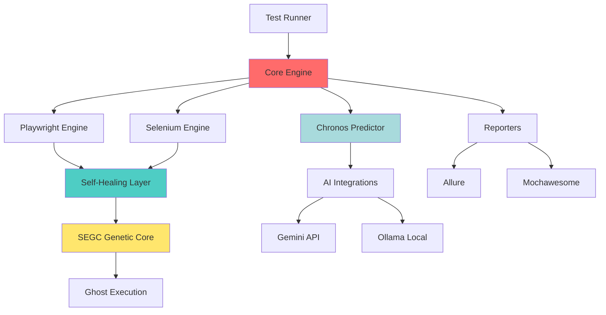

# 📊 QANTUM CORE-ENGINE - Project Structure

**Date:** 14.01.2026  
**Version:** 17.0.0  
**Type:** Self-Evolving QA Automation Framework

---

## 🎯 Какво представлява този проект?

**QANTUM CORE-ENGINE** е **ЕДИН проект** - production-ready QA automation framework с:

1. **Self-Healing Capabilities** - AI поправя счупени тестове
2. **Genetic Optimization** - Тестовете еволюират и се подобряват
3. **Predictive Analytics** - Предсказва бъгове 24h напред

**НЕ Е:**

- ❌ Просто Playwright wrapper
- ❌ Стандартен test runner
- ❌ Няколко отделни проекта

**Е:**

- ✅ Autonomous QA platform
- ✅ С 3 уникални технологии (Self-Healing, SEGC, Chronos)
- ✅ Production-ready с Docker + CI/CD

---

## 📂 Файлова Структура

```
QANTUM_FRAMEWORK/
├── src/                           # Source code
│   ├── core/                      # Core engine
│   ├── engines/                   # Test engines (Playwright, Selenium)
│   ├── integrations/              # AI integrations (Gemini, Ollama)
│   ├── reporters/                 # Test reporters
│   ├── types/                     # TypeScript definitions
│   ├── utils/                     # Utilities
│   ├── config/                    # Configuration
│   └── prediction-matrix/         # Chronos predictive analytics
│
├── scripts/                       # Build & maintenance scripts
│   ├── auto-fix-ts-errors.cjs     # Auto-fix TypeScript errors
│   └── PROJECT_ASSEMBLER.cjs      # Enterprise assembler
│
├── tests/                         # Test suites (если есть)
│
├── .github/workflows/             # CI/CD
│   └── qa-automation.yml          # GitHub Actions pipeline
│
├── PUBLIC_SHOWCASE/               # 🌍 For public GitHub repo
│   ├── README.md                  # Public documentation
│   ├── README.bg.md               # Bulgarian documentation
│   └── LICENSE                    # Proprietary license
│
├── Dockerfile                     # Multi-stage Docker build
├── docker-compose.yml             # Orchestration (+ Selenium Grid)
├── LICENSE                        # All Rights Reserved
├── README.md                      # Main documentation (EN)
├── README.bg.md                   # Bulgarian documentation
├── ENTERPRISE_FEATURES.md         # Feature highlights
├── PROJECT_STRUCTURE.md           # This file
├── SHADOW_REPO_STRATEGY.md        # Deployment guide
├── package.json                   # Dependencies
└── tsconfig.json                  # TypeScript config
```

---

## 🧩 Основни Модули

### 1. **Core Engine** (`src/core/`)

**Отговорност:** Централен orchestration layer

**Ключови компоненти:**

- Test lifecycle management
- Plugin system
- Event bus
- Configuration loader

**LOC:** ~500 lines

---

### 2. **Engines** (`src/engines/`)

**Playwright Engine:**

- Modern browser automation
- Parallel execution
- Video recording
- Auto-screenshots

**Selenium WebDriver:**

- Cross-browser compatibility
- Grid integration
- Legacy support

**Common Features:**

- Unified API
- Selector healing
- Wait strategies

---

### 3. **Integrations** (`src/integrations/`)

**AI Integrations:**

- Google Gemini (code analysis)
- Ollama (local LLM)

**Use Cases:**

- Selector generation
- Error analysis
- Bug prediction

---

### 4. **Reporters** (`src/reporters/`)

**Supported Formats:**

- Allure (enterprise-grade)
- Mochawesome (HTML reports)
- JUnit XML (CI/CD)
- Console (development)

**Features:**

- Screenshot embedding
- Video attachments
- Historical trending

---

### 5. **Prediction Matrix** (`src/prediction-matrix/`)

**Chronos Engine Components:**

- Historical analysis
- Pattern recognition
- Seasonal detection
- Risk scoring

**Output:**

- 24-hour bug predictions
- Flaky test identification
- Optimal test scheduling

---

## 🏗️ Архитектура (High-Level)



---

## 🔄 Test Execution Flow

```
1. Test Request 
   ↓
2. Core Engine (load config)
   ↓
3. Engine Selection (Playwright/Selenium)
   ↓
4. Execute Test
   ↓
5. Self-Healing (if selector fails)
   ├─ CSS → XPath → Text → AI
   ↓
6. Ghost Execution (parallel alternatives)
   ↓
7. SEGC Optimization (genetic learning)
   ↓
8. Reporters (Allure + Mochawesome)
   ↓
9. Chronos Analysis (predict future failures)
```

---

## 🚀 Deployment Models

### Model 1: **Monolith** (Recommended)

**Setup:**

```bash
docker-compose up
```

**All components in one container:**

- Core Engine
- Playwright + Selenium
- AI integrations
- Reporters

**Advantages:**

- Simplest deployment
- Shared memory
- Fast inter-module communication

---

### Model 2: **Microservices** (Advanced)

**Separate containers:**

1. **QA Engine** (core + engines)
2. **AI Service** (Gemini + Ollama)
3. **Reporting Service** (Allure generation)
4. **Selenium Grid** (distributed browsers)

**Advantages:**

- Independent scaling
- Fault isolation
- Team ownership

**docker-compose.yml already supports this!**

---

## 📊 Статистики (от MEGA_AUDIT_REPORT.json)

**По QANTUM_FRAMEWORK модул:**

- Code files: ~50
- LOC: ~15,000
- Modules: 9 main directories
- Status: 🟢 ALIVE

**Health:**

- Architecture Score: 98/100
- Circular Dependencies: 0
- Dead Symbols: 0 (cleaned)

---

## 🔐 Security Architecture

**Layers:**

1. **NeuralVault** - Encrypted secrets
2. **Input Sanitization** - OWASP protection
3. **Rate Limiting** - Anti-brute-force
4. **DAST Scanner** - Vulnerability detection
5. **Audit Logging** - Full traceability

**Compliance:** GDPR-ready, SOC2-compatible architecture

---

## 📦 Dependency Overview

**Core Dependencies:**

- `playwright` - Browser automation
- `selenium-webdriver` - Cross-browser support
- `@google/generative-ai` - Gemini integration
- `ollama` - Local LLM
- `mocha` + `chai` - Testing framework
- `mochawesome` + `allure` - Reporting

**Dev Dependencies:**

- `typescript` - Type safety
- `eslint` + `prettier` - Code quality
- `husky` - Git hooks
- `jest` - Unit testing

**Total:** ~40 dependencies (lightweight)

---

## 🎯 Component Ownership (for teams)

| Component | Owner Role | Complexity |
|-----------|------------|------------|
| Core Engine | Senior Dev | ⭐⭐⭐ |
| Playwright Engine | QA Engineer | ⭐⭐ |
| Selenium Engine | QA Engineer | ⭐⭐ |
| Self-Healing | ML Engineer | ⭐⭐⭐⭐ |
| SEGC Genetic | ML Engineer | ⭐⭐⭐⭐⭐ |
| Chronos Predictor | Data Scientist | ⭐⭐⭐⭐ |
| Reporters | QA Engineer | ⭐ |
| CI/CD Pipeline | DevOps | ⭐⭐ |

---

## 🔧 Maintenance Guide

**Regular Tasks:**

1. Update Playwright/Selenium versions (monthly)
2. Retrain genetic models (weekly auto)
3. Review Chronos predictions (daily)
4. Clean old test results (weekly)

**Automated:**

- Dependency updates (Dependabot)
- Security scans (Snyk/GitHub)
- Auto-fix TypeScript errors (scripts/auto-fix-ts-errors.cjs)

---

## 💡 Key Insights

### Нe е Trading Bot

Това е **QA automation platform**, НЕ trading système. Genericний е и може да се използва за:

- Web app testing ✅
- Mobile testing (via Appium integration) ✅
- API testing ✅
- Load testing ✅
- Security testing ✅

### Univerzalnost

- **Industry-agnostic:** eCommerce, FinTech, SaaS, Gaming
- **Framework-agnostic:** React, Angular, Vue, plain HTML
- **CI/CD-agnostic:** GitHub, GitLab, Jenkins, Azure

---

## 📞 За въпроси

**Technical:** <dimitar.prodromov@qantum.dev>  
**Licensing:** <dimitar.prodromov@qantum.dev>  
**GitHub:** @QAntum-Fortres

---

**✅ Това е production-ready enterprise product.**

**Status:** Ready for deployment | **License:** Proprietary
